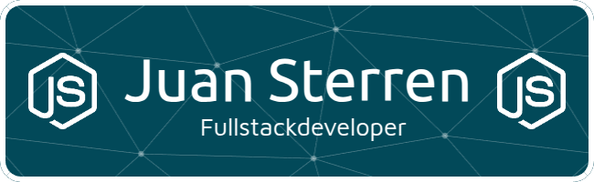

  

  

    <a href="https://www.linkedin.com/in/sterrenjuan/"><strong>LinkedIn</strong></a> |
    <a href="https://jsterren.vercel.app/"><strong>Portfolio</strong></a>
  

  ## Tech Stack:

  ### PHP
  
  

  ### JavaScript / TypeScript
  
  
  
  
  
  
  
  
  
  
  

  ### Databases
  
  
  
  
  
  

  ### Tools / Others
  
  
  
  

  # 📊 GitHub Stats:
   
   
  

  

